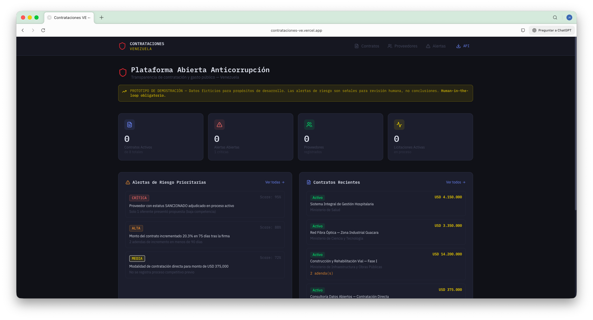
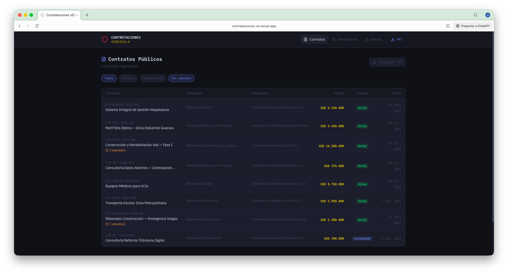
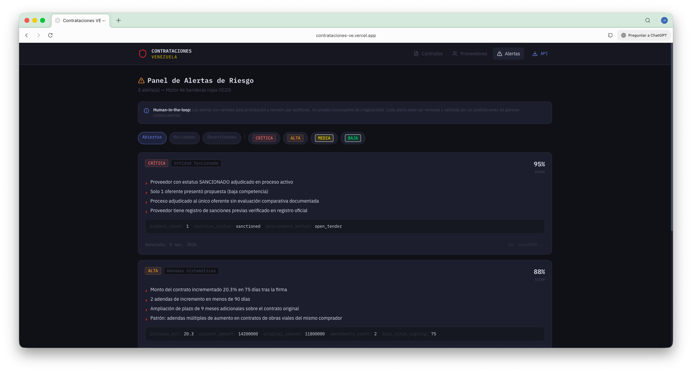
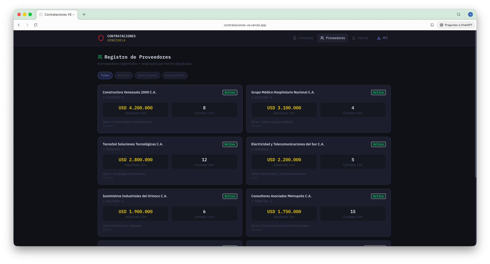
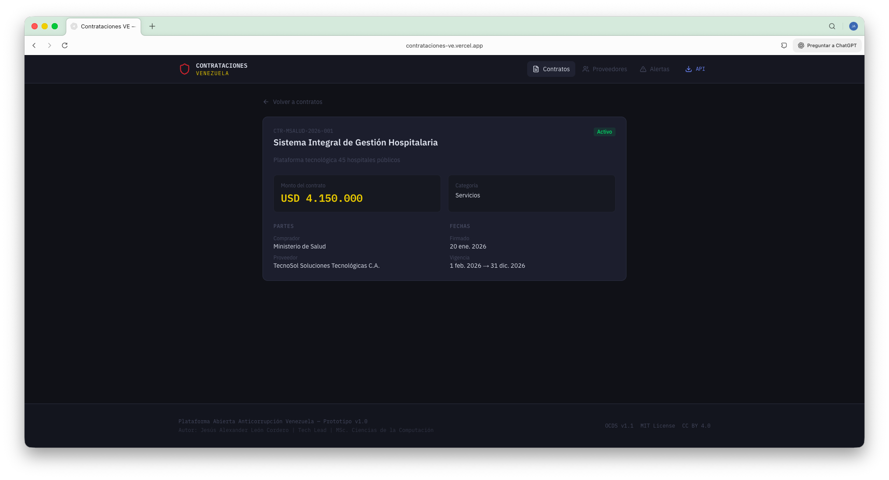

<div align="center">

# 🛡️ Contrataciones VE
### Plataforma Abierta Anticorrupción de Contratación y Gasto Público para Venezuela

*Propuesta de política pública, arquitectura de datos y modelo de implementación para transparencia, trazabilidad y detección temprana de riesgos*

---

[](https://zenodo.org/records/19024729)
[](LICENSE)
[](LICENSE-CC-BY-4.0)
[](https://standard.open-contracting.org/)
[](https://contrataciones-ve.vercel.app)

**Autor:** Jesús Alexander León Cordero — Tech Lead | MSc. Ciencias de la Computación
**Versión:** 1.0 · **Fecha:** 14 de marzo de 2026 · **Región:** Venezuela

</div>

---

## 📋 Sobre este proyecto

Este repositorio implementa el prototipo funcional descrito en el paper académico:

> **León Cordero, J. A.** (2026). *Plataforma abierta anticorrupción de contratación y gasto público para Venezuela: propuesta de política pública, arquitectura de datos y modelo de implementación para transparencia, trazabilidad y detección temprana de riesgos*. Zenodo. [https://zenodo.org/records/19024729](https://zenodo.org/records/19024729)

Venezuela cuenta con fundamentos legales e institucionales para avanzar en una política de transparencia proactiva en contratación pública (CRBV Arts. 141–143, Ley de Contrataciones Públicas G.O. N° 6.154), pero la información relevante permanece fragmentada, parcialmente accesible y con baja interoperabilidad.

Este prototipo convierte esa información dispersa en **infraestructura pública digital** que conecta proceso, proveedor y dinero — con APIs abiertas, motor de alertas explicables y revisión humana obligatoria.

---

## 🖼️ Capturas de pantalla

| Dashboard | Contratos |
|:---------:|:---------:|
|  |  |
| Panel principal con métricas en tiempo real | Tabla con filtros y descarga CSV |

| Alertas de Riesgo | Proveedores | Detalle de Contrato |
|:-----------------:|:-----------:|:-------------------:|
|  |  |  |
| Banderas rojas OCDS con score y human-in-the-loop | Registro con estado de sanciones y montos | Vista individual con fechas y partes |

---

## 🏗️ Arquitectura

El sistema implementa la arquitectura de referencia del paper, diseñada sobre cinco capas:

```
┌─────────────────────────────────────────────────────────┐
│                    FRONTEND (Next.js 14)                 │
│   Dashboard · Contratos · Proveedores · Alertas         │
└────────────────────────┬────────────────────────────────┘
                         │ REST / JSON
┌────────────────────────▼────────────────────────────────┐
│               API PÚBLICA (FastAPI + OpenAPI 3.1)        │
│   /processes · /contracts · /suppliers · /risk/alerts   │
│   /download/contracts.csv · /download/ocds/releases.json│
└────────────────────────┬────────────────────────────────┘
                         │ SQLAlchemy 2.0 async
┌────────────────────────▼────────────────────────────────┐
│               CAPA DE DATOS (Supabase / PostgreSQL)      │
│   suppliers · processes · contracts · risk_alerts        │
│   contract_amendments · contract_payments                │
└────────────────────────┬────────────────────────────────┘
                         │
┌────────────────────────▼────────────────────────────────┐
│               MOTOR DE RIESGO (Python)                   │
│   Adendas sistemáticas · Proveedores sancionados        │
│   Baja competencia · Sobrecostos en emergencias         │
└─────────────────────────────────────────────────────────┘
```

### Stack tecnológico

| Capa | Tecnología |
|------|-----------|
| Backend | Python 3.12 · FastAPI · SQLAlchemy 2.0 · Pydantic v2 |
| Frontend | Next.js 14 App Router · TypeScript · Tailwind CSS |
| Base de datos | Supabase (PostgreSQL managed) · asyncpg |
| Estándar de datos | OCDS v1.1 (Open Contracting Data Standard) |
| API spec | OpenAPI 3.1.0 · RFC 3339 timestamps |
| Despliegue | Vercel (frontend) · Render (backend) · Supabase |
| Contenerización | Docker · docker-compose |

---

## 🔴 Motor de Alertas de Riesgo (Red Flags OCDS)

El motor implementa tres familias de banderas rojas explícitas con **revisión humana obligatoria** antes de generar consecuencias — principio central del paper:

| Tipo de Alerta | Indicador | Severidad |
|---------------|-----------|-----------|
| `systematic_amendments` | Contratos con ≥2 adendas de incremento o >15% sobre monto original | 🟠 Alta / 🔴 Crítica |
| `repeat_entity` | Proveedor sancionado o suspendido con contrato activo | 🔴 Crítica (score 0.95) |
| `low_competition` | Proceso con ≤1 oferente o contratación directa de alto valor | 🟡 Media / 🟠 Alta |
| `overprice` | Contrato de emergencia con monto final >20% sobre lo licitado | 🟠 Alta / 🔴 Crítica |

> ⚠️ **Human-in-the-loop obligatorio:** Las alertas son señales para priorización y revisión por auditores — no prueba concluyente de irregularidad. Toda alerta requiere validación humana antes de generar consecuencias institucionales.

---

## 📊 Modelo de datos (OCDS-compatible)

```
suppliers          processes (licitaciones)     contracts
─────────          ────────────────────         ─────────
id (UUID)          id (UUID)                    id (UUID)
rif                ocid                         contract_number
name               title                        process_id → processes
sector             status                       supplier_id → suppliers
sanction_status    procurement_method           buyer_name
awards_count_12m   buyer_name                   amount / currency
total_awarded_12m  tender_amount                signed_at / end_date
                   awarded_supplier_id          has_amendments
                   bidders_count                amendments_count

risk_alerts                contract_amendments      contract_payments
───────────                ───────────────────      ─────────────────
type                       contract_id              contract_id
severity (low→critical)    amendment_number         payment_number
score [0.0–1.0]            amount_change            amount
status (open→reviewed)     new_end_date             payment_date
explanation (JSONB)        signed_at                status
supporting_data (JSONB)
```

---

## 🚀 Inicio rápido

### Prerrequisitos

- Python 3.12+
- Node.js 20+
- Cuenta en [Supabase](https://supabase.com) (gratuita)
- Docker (opcional)

### 1. Clonar y configurar

```bash
git clone https://github.com/jaleco8/contrataciones-ve
cd contrataciones-ve

# Backend — copiar y editar con tus credenciales de Supabase
cp backend/.env.example backend/.env

# Frontend — URL del backend
cp frontend/.env.local.example frontend/.env.local
```

### 2. Base de datos (Supabase)

En el **SQL Editor** de tu proyecto Supabase, ejecutar en orden:

```sql
-- 1. Schema completo (tablas, índices, triggers, vistas)
supabase/migrations/001_initial_schema.sql

-- 2. Datos de demostración (ficticios)
supabase/seed.sql
```

### 3. Backend

```bash
cd backend
python -m venv venv
source venv/bin/activate   # Windows: venv\Scripts\activate
pip install -r requirements.txt
uvicorn app.main:app --reload --port 8000
```

- API: [http://localhost:8000](http://localhost:8000)
- Docs interactivos: [http://localhost:8000/docs](http://localhost:8000/docs)

### 4. Frontend

```bash
cd frontend
npm install
npm run dev
```

- App: [http://localhost:3000](http://localhost:3000)

### 5. Con Docker

```bash
docker-compose up --build
```

---

## 🔌 API Pública (OpenAPI 3.1)

Todos los endpoints devuelven JSON UTF-8, timestamps en UTC (RFC 3339) y paginación estándar con metadatos.

| Método | Endpoint | Descripción |
|--------|----------|-------------|
| `GET` | `/api/v1/processes` | Procesos de contratación — licitaciones y adjudicaciones |
| `GET` | `/api/v1/contracts` | Contratos firmados con trazabilidad de adendas |
| `GET` | `/api/v1/suppliers` | Registro de proveedores y estado de sanciones |
| `GET` | `/api/v1/risk/alerts` | Alertas de riesgo activas con explicación y score |
| `PATCH` | `/api/v1/risk/alerts/{id}` | Revisar o desestimar alerta (human-in-the-loop) |
| `GET` | `/api/v1/download/contracts.csv` | Descarga masiva — todos los contratos en CSV |
| `GET` | `/api/v1/download/ocds/releases.json` | Exportación OCDS JSON (paquete completo) |

### Ejemplo de respuesta paginada

```json
{
  "meta": {
    "page": 1,
    "page_size": 20,
    "total_results": 248,
    "total_pages": 13,
    "sort": "signed_at",
    "order": "desc",
    "timezone": "UTC"
  },
  "data": [ ... ]
}
```

### Estados del ciclo contractual

```
processes:  planned → tender → awarded | cancelled | complete
contracts:  draft → active → completed | terminated | cancelled
alerts:     open → reviewed | dismissed
suppliers:  active | sanctioned | suspended
```

---

## 📦 Estructura del monorepo

```
contrataciones-ve/
├── backend/
│   ├── app/
│   │   ├── core/          # config.py · database.py
│   │   ├── models/        # SQLAlchemy: supplier, process, contract, risk_alert
│   │   ├── schemas/       # Pydantic v2: respuestas y validación
│   │   ├── api/v1/        # FastAPI routers: processes, contracts, suppliers, risk, download
│   │   └── services/      # risk_engine.py — motor de banderas rojas
│   ├── requirements.txt
│   └── Dockerfile
├── frontend/
│   ├── app/               # Next.js App Router: /, /contracts, /suppliers, /risk
│   ├── components/        # layout/, contracts/, suppliers/, risk/
│   └── lib/               # api.ts · types.ts · utils.ts
└── supabase/
    ├── migrations/001_initial_schema.sql
    └── seed.sql
```

---

## 🗺️ Fases de implementación (del paper)

El paper propone un modelo de implementación por fases progresivas:

| Fase | Horizonte | Hitos clave | Presupuesto |
|------|-----------|-------------|-------------|
| **T1a** Preparación | 0–3 meses | Lineamientos, estándar de datos, gobernanza | EUR 0.3–0.8M |
| **T1b** MVP público | 4–9 meses | Portal público, API v1, licitaciones y adjudicaciones piloto | EUR 1.2–3.0M |
| **T2** Despliegue ampliado | 10–18 meses | Contratos, adendas, pagos, red flags v1 | EUR 3.0–7.8M acum. |
| **T3** Escalamiento nacional | 19–30 meses | Integración nacional progresiva, descargas masivas, SLA público | EUR 5.0–13.8M acum. |
| **T4** Madurez analítica | 31–48 meses | Modelos ML calibrados, grafos, auditoría asistida | EUR 1.0–3.0M adicional |

> 📌 *Este prototipo corresponde a la fase T1b — MVP público funcional para validar supuestos de integración, calidad de datos y rendimiento analítico antes de la expansión nacional.*

---

## 📐 Estándares y referencias normativas

| Estándar | Uso en la plataforma |
|----------|---------------------|
| [OCDS v1.1](https://standard.open-contracting.org/) | Modelo base de datos de contratación, releases y records |
| [OpenAPI 3.1.0](https://spec.openapis.org/oas/v3.1.0) | Especificación de la API pública |
| [RFC 3339](https://www.rfc-editor.org/rfc/rfc3339) | Timestamps UTC en todas las respuestas |
| [CRBV Arts. 141–143](http://www.cne.gob.ve/web/normativa_electoral/constitucion/indice.php) | Base constitucional de transparencia y rendición de cuentas |
| [Decreto-Ley Contrataciones Públicas G.O. 6.154](http://www.minci.gob.ve/) | Marco legal de publicación y notificaciones electrónicas |
| [Ley de Infogobierno (2013)](http://www.minci.gob.ve/) | Infraestructura digital pública con estándares abiertos |

---

## 🚢 Despliegue en producción

### Frontend → Vercel

Conectar el repositorio en [vercel.com](https://vercel.com). Configurar variable:
```
NEXT_PUBLIC_API_URL=https://tu-backend.onrender.com
```

### Backend → Render

Configuración recomendada:
- **Root Directory:** `backend`
- **Dockerfile Path:** `./Dockerfile`
- **Docker Build Context:** `.`

Variables de entorno requeridas: `DATABASE_URL`, `SUPABASE_URL`, `SUPABASE_KEY`, `CORS_ORIGINS`

### Secrets para GitHub Actions

```
DATABASE_URL · SUPABASE_URL · SUPABASE_KEY · SECRET_KEY
VERCEL_TOKEN · VERCEL_ORG_ID · VERCEL_PROJECT_ID
RENDER_DEPLOY_HOOK_URL
```

---

## 📖 Cita del paper

Si usas este proyecto en investigación o desarrollo, por favor cita:

```bibtex
@techreport{leoncordero2026plataforma,
  title     = {Plataforma abierta anticorrupci{\'o}n de contrataci{\'o}n y gasto
               p{\'u}blico para Venezuela: propuesta de pol{\'i}tica p{\'u}blica,
               arquitectura de datos y modelo de implementaci{\'o}n para
               transparencia, trazabilidad y detecci{\'o}n temprana de riesgos},
  author    = {Le{\'o}n Cordero, Jes{\'u}s Alexander},
  year      = {2026},
  month     = {March},
  doi       = {10.5281/zenodo.19024729},
  url       = {https://zenodo.org/records/19024729},
  version   = {1.0},
  license   = {CC BY 4.0}
}
```

---

## 📜 Licencias

| Componente | Licencia |
|-----------|---------|
| Código fuente | [MIT](LICENSE) |
| Datos de demostración | [CC BY 4.0](LICENSE-CC-BY-4.0) |
| Paper académico | [CC BY 4.0](https://zenodo.org/records/19024729) |

---

<div align="center">

**Jesús Alexander León Cordero**
Tech Lead | MSc. Ciencias de la Computación

*"El valor estratégico radica en tratar la contratación pública como un sistema de datos,*
*no como transacciones aisladas."*

[📄 Leer el paper completo](https://zenodo.org/records/19024729) · [🌐 Ver demo](https://contrataciones-ve.vercel.app) · [📚 API Docs](https://contrataciones-ve.vercel.app/docs)

</div>
